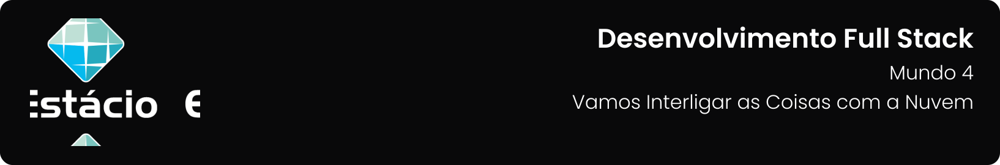

---

[Projeto](#-projeto) • [Como baixar e executar](#-como-baixar-e-executar) • [Procedimentos](#-procedimentos) • [Tecnologias utilizadas](#-tecnologias-utilizadas) • [Autor](#-autor) • [Licença](#-licença)

---

## 📋 Projeto

Missão Prática com o objetivo de visualizar em tempo real os dados de sensores conectados ao Azure IoT Hub, usando um aplicativo web hospedado localmente ou no Azure **`Nível 5: Vamos Interligar as Coisas Com a Nuvem`** do **`Mundo 4`** do curso de **`Desenvolvimento Full Stack`** da **`Estácio`**, do semestre de **`2024.2`**.

Projeto elaborado de acordo com as diretrizes especificadas para a Missão Prática, que podem ser conferidas [**`clicando aqui`**](https://sway.cloud.microsoft/s/pAU9GmfP8IF2OLSg/embed).

## 📥 Como baixar e executar

Para baixar os arquivos deste repositório, você deve ter o [GitHub](https://github.com/) instalado em seu dispositivo.

Após instalado, você deverá acessar a guia `Arquivo` → `Clonar repositório` → `URL` e incluir o caminho `guedesert/vamos-interligar-as-coisas-com-a-nuvem`.

Além disso, faz-se necessário ter acesso ao [Azure IoT Hub](https://portal.azure.com/#home).

## 🔗 Procedimentos

Durante o projeto foram desenvolvidos os procedimentos descritos abaixo:

<table>
  <tr>
    <th>Procedimentos</th>
  </tr>
  <tr>
    <td>
      <ul>
        <li>Baixar e explorar o código do GitHub no VS Code.</li>
        <li>Criar um grupo de consumidores no hub IoT.</li>
        <li>Configurar as variáveis de ambiente com a conexão do IoT Hub.</li>
        <li>Instalar e executar o app localmente com npm install e npm start.</li>
        <li>Criar um plano de serviço no Azure para hospedar o app.</li>
        <li>Provisionar o aplicativo no Azure.</li>
        <li>Ativar WebSockets e HTTPS e verifiquar o status.</li>
        <li>Acessar o app no Azure e visualizar os dados em tempo real.</li>
      </ul>
    </td>
  </tr>
</table>

Para acessar o relatório da Missão Prática, clique no botão abaixo:

## 🛠 Tecnologias utilizadas

Para a construção e execução do projeto foram utilizadas as seguintes tecnologias:

## 👥 Autor

| Aluno                                                  | Matrícula    | E-mail                                      |
| ------------------------------------------------------ | ------------ | ------------------------------------------- |
| [Emanuel Roseira Guedes](https://github.com/guedesert) | 202212181407 | [📧](mailto:202212181407@alunos.estacio.br) |

## 📃 Licença

Este repositório está licensiado sob a [Licença MIT](./LICENSE).

